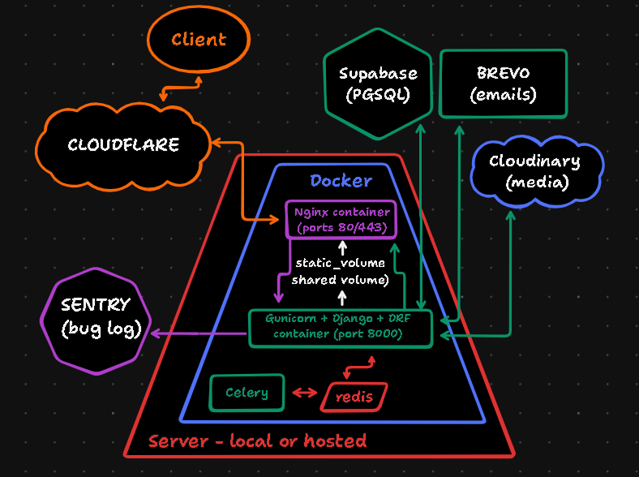
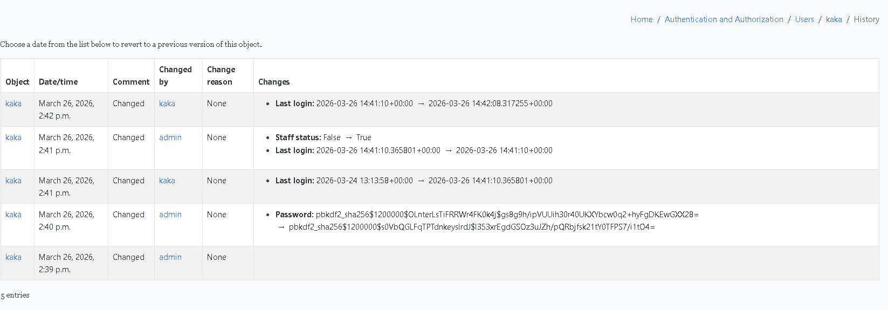
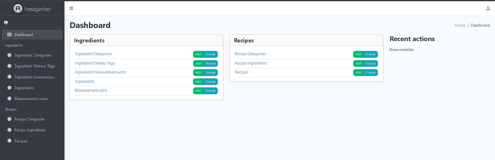
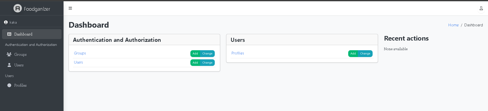
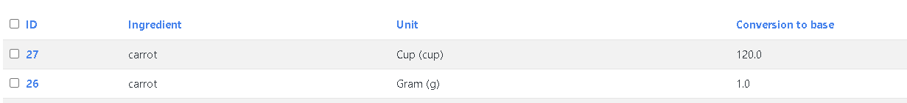
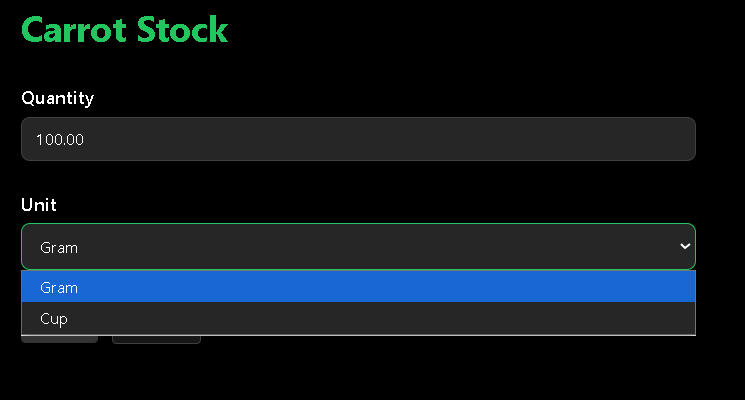
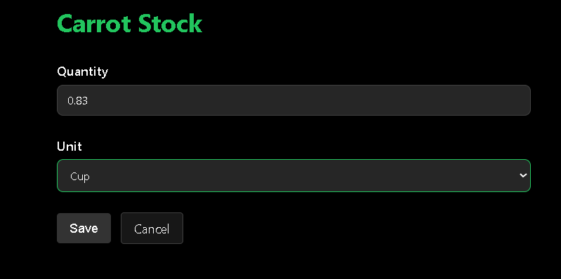

# Project Structure

## User | Profile | Authentication 
    - Using Dhango's User + a custom Profile model (OTO relationship)
    - User is for authentication and Profile is for more data (such as bio, profile picture)
    - Authentication modifications: a custom backend that allows login via username OR email
    - When a User is crated via the RegisterForm form, a Profile is also created (handled in the form on save())
    - When a User is created via the Django Admin, a Profile is also created (handled in the create_profile_for_user signal)

## Groups | Permissions | Authorization
    - Django admin extended with history - we can see who edited what and when:

(Django Admin History)

### User group
#### Function: No special function, standard user. The group is for identification and easy access updates if needed

    - No access to Django Admin. 
    - Can edit one's own profile (names, bio, profile pic) and user (password reset)
    - Can add Ingredient, Recipe, Measurement Unit, Ingredient Measurement Unit, Ingredient Dietary Tag, Ingredient/Recipe Category, Reicpe Ingredient
    - Can edit/delete any of the above, as long as they were created by the same user (If user1 created apple, they can edit/delete it. They cannot delete items created by user2)

### Moderator Group
#### Function: Moderate the content users create (like deleting bad words or troll records)
    - Can access Django Admin, has access all non-user related records (Recipes, Ingredients, etc)
    - Full CRUD access to Ingredient, Recipe, Measurement Unit, Ingredient Measurement Unit, Ingredient Dietary Tag, Ingredient/Recipe Category, Reicpe Ingredient
    - Can edit/delete records created by other users (both from the official webpage, as well as the admiin interface)
    - Cannot edit User/Profile 

(Django Admin Moderator Dashboard)

### Service Desk Group
#### Function: Assist users with password reset and personal data updates
    - Can access Django Admin, has access to all user related records (Users, Profiles, Groups)
    - Only has user-level access to everyhitng else (lke recipes, ingredients)

(Django Admin Service Desk Dashboard)

## Ingredients | Measurement Units | Categories | Dietary Tags | Nutrients
### Ingredient attributes: 
    - name
    - DU&BQ - default_unit & base_quantity (ex: when saving an ingredient, we can say the default is 100grams. Then when we enter any nutritional information, that will be for 100g. Any conversions we do from there will rely on this data)
    - nutrients - already defined constants (kcal, fat, zinc, etc). We can choose to leave them as 0 or add nutritional value for the ingredient based on the DU&BQ. They are automatically added to a recipe when we assign it with ingredients.  
### Ingredient relationships:
    - category - kept as a separate table with FK relationship, on delete cascade
    - dietary tags - kept as a separate table with MTM relationship, on delete cascade

### Measurement Unit attributes: 
    - code - charfield, unique, max len 10 (ex: G for Grams)
    - singular name - ex: gram
    - plural name - ex: grams

### Ingredient Measurement Unit relationships:
    - ingredient as FK
    - unit as FK
    - conversion to base (float) - in relation to the base quantity (ex: imagine an ingredient with a DU&BQ of 100g. We want to add a cup measurment to it. This will store the quantity/weight of 1 cup of the same ingredient. if 1 cup of that ingredient weighs 120g, the conversion is 120. The conversion is 1 if the unit is the default unit.  

(Carrot Example - 1 cup of carrots equals 120g. The DU&BQ for carrots was set as 100 grams, so we store is as 1)

## Recipes | Categories | Recipe Ingredients
### Recipes attributes:
    - name
    - cooking time (time filed but is taken from users as 2 inputs - hours and minutes)
    - sevings - ex: a pizza can have 8 servings (slices in this case) and you can decide to eat only a few. This is important for kcal logging. 
    - insturctions 

### Recipes relationships:
    - category - FK, on delete set null
    - favourited_by - MTM, keeps a record of user favourites 

### Recipe Ingredients relationships:
    - recipe - FK on delete cascade
    - ingredient - FK on delete casecade
    - quantity - float  
    - unit - FK
    - unique_together = ('recipe', 'ingredient')

## Planner - Fridge | Meal Suggestions | Grocery List 
    - Non-authenticated (anon) user can use most planner tools, the data is kept in the session of their browser and can be saved to DB upon registartion. 

### Fridge
    - A digital fridge is kept for all users in the DB. For anon (not authenticated) users, a temp fridge is kept in the browser session
    - Full CRUD to the fridge - add, remove or edit the quantity/unit of ingredinets in the fridge
    - Automatic convestion on edit - if you have 100g of something but then your American friend comes over to cook you some dinner, they can select cups from the dropdown and the quanitty will convert with some JS magic. Don't worry, you can switch it back and forth as many times as you want:

(Fridge Example - 100g of carrot in the fridge -> select cup from the dropdown -> instant transformation)

###  Meal Suggestions
    - Based on the ingredients in the fridge, users can get meal suggestions
    - This work for authenticated users (saves to DB) and anon users (kept in the session)
    - When making a meal from the suggestions, the whole meal is added to the kcal tracker on the current date (auth users only)
    - All made meals can be viewed in My Meal History (both for auth and anon users)

### Grocery list
    - Generate a grocery list from user selected recipes. Auth users can filter by favourite recipes. 
    - The list is available in My Grocery List (both for auth and anon users)
    - Items from the grocery list can be moved to the fridge (both for auth and anon users)

### Biometrics 
    - A calculator for BMR (Basal Metabolic Rate) and TDEE (Total Daily Energy Expenditure) based on user input
    - Saves to DB for auth users and is kept in session for anon users. The DB data is used for the kcal tracker

### KCALendar (Calorie Tracker Calendar)
    - Auth users only
    - The kcal tracker is a calendar that allows users to log ingredients + quantity & unit and recipes + serving
    - It calculates consumed kcal and compares against the target set in biometrics 
    - It has a calculator that can show how much weight of fat specifivally a person has gained/lost baded on the logs with contsant 1kg of fat = 7830 kcal

## Notes:
1. This project was developed in 2 parts for an uni exam. The first one required no user auth. Now that I have an existing DB structure with multiple migrations, I will use a Profile model (OneToOne), as opposed to an AbstractUser class, because I'd like to keep my migrations - they mark my progress, my previous errors and redesigns I've done. 

2. I fully intend to replace all AI images with real art. The deadlines were tight and I needed something to prototype. This is a student project with no funding. 

    
